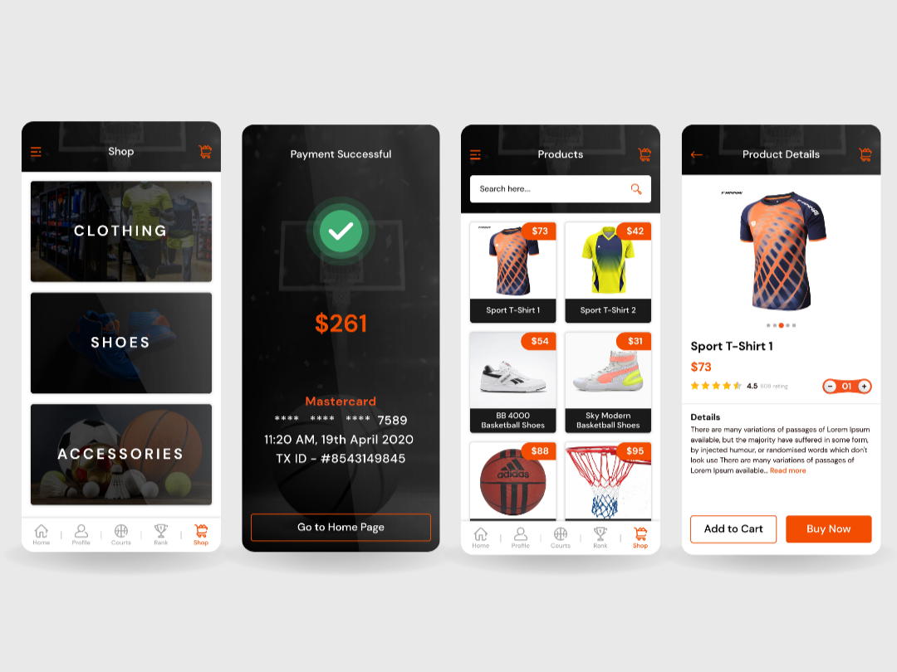

# BallChamps – Sports Companion App

BallChamps is a dynamic, feature-rich mobile app developed for both Android and iOS, built entirely in **.NET (C#)**. Designed to enhance the sports fan experience, the app delivers real-time updates, live scores, player statistics, match schedules, and more.

I led the **full development lifecycle** of this project—from back-end integration to front-end UI/UX design—ensuring high performance, intuitive navigation, and seamless data flow via API integration.

The result is a sleek, engaging sports platform that caters to a wide audience with reliability and style.

---

